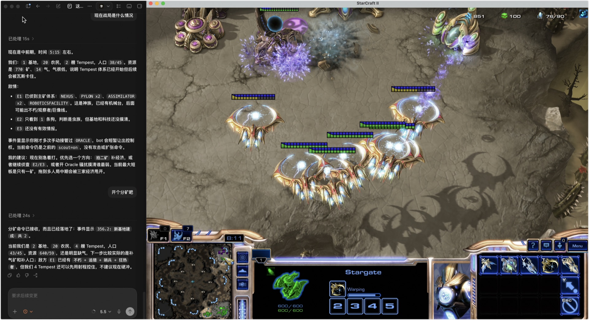

# code-agent-sc2

**Commanding StarCraft II with a local coding agent — a 0-APM RTS experiment.**

🇬🇧 English · [🇨🇳 中文](README.md)



*Left — a local coding agent (here, Claude Code) as your chief-of-staff: it reads the live
battle, briefs the enemy, and proposes moves ("take a second base?"). Right — the self-driving
bot it commands. You speak intent in plain words; it reads the fight and pulls the strategy
levers. You never touch micro.*

---

A competent bot (built on [ares-sc2](https://github.com/AresSC2/ares-sc2)) plays the whole
game by itself. During the match, a human **commander** speaks *intent* in natural language
("scout him", "pressure the natural", "tech to sky, don't feed") to an LLM acting as
**chief-of-staff**. The LLM reads the live battle state, analyses the enemy, proposes options,
and — once you give the order — translates it into a small set of **high-level levers**. It
never micromanages units. The result is a **zero-APM RTS**: command, not mechanics.

The official face of this project is **Protoss** — an Aristaeus-style *Tempest sky + Oracle
harass* build, and that line is battle-tested. Under the hood the bot is **race-agnostic and
composition-configurable**: a single `army_composition.yml` registers every unit for all three
races, and both production (what to build) and command (which combat micro each unit uses) read
from it — so **adding a unit usually means editing that yaml, not touching Python**. The Terran
and Zerg production paths, plus per-unit specials (siege-tank sieging, medivac heal & drops,
High Templar storm, Ghost snipe, and more), are all scaffolded (control-ready) but not yet
individually battle-tested; see `docs/status-and-roadmap.md`.

```
   You (chat)  ──intent──▶  LLM chief-of-staff
                               │  reads  state.json     (what's happening)
                               │  writes orders.json    (a few high-level levers)
                               ▼
        ~/agent-rts-steer/   (two JSON files, atomic swap)
                               ▲
                     ares bot │ every ~4 game-seconds: publish state, read orders, apply
                               ▼
              StarCraft II (free client)  vs  built-in AI
```

Five layers: **SC2 free client** ← **python-sc2** ← **ares self-driving bot** ← **two JSON
files** (`~/agent-rts-steer/`) ← **a constrained lever vocabulary** ← **the LLM commander**.

## Why it's interesting

- **Command vs. mechanics.** Most RTS AI work automates micro. This does the opposite: the
  machine handles mechanics, the human (through an LLM) supplies *strategy*. APM ≈ 0.
- **LLM-in-the-loop, live.** The LLM isn't a pre-game planner — it reads fog-of-war intel,
  narrates threats, and re-steers mid-fight through a file channel.
- **A tiny, legible interface.** The whole command surface is ~10 sticky fields
  (`stance / target / focus / build / scout / …`). Easy to read, easy to extend, easy to drive
  from *any* LLM — not just Claude.

## Repository layout

| Path | What |
|---|---|
| `smoke.py` | Stage-0 probe: can python-sc2 launch the client and finish a game? (bare burnysc2, no ares) |
| `ares-bot/` | The real bot + steer layer (Python 3.11 + Poetry) |
| `ares-bot/bot/main.py` | The `AresBot` subclass: plays full-game + the steer seam + human co-driving hand-off |
| `ares-bot/bot/managers/` | Three managers: `combat` (commands the army) / `production` (units & economy) / `oracle` (harass) |
| `ares-bot/bot/combat/` | Per-unit combat classes (built on ares combat primitives); units without a special use `generic_offensive` |
| `ares-bot/army_composition.yml` | Single source of truth for units (all three races registered); production & command both read it — **add units here** |
| `ares-bot/bot/army_config.py` | Loads `army_composition.yml`, splits by race, validates |
| `ares-bot/bot/levers.py` | Pure lever logic (semantic → coordinate/enum, unit-testable offline) |
| `ares-bot/bot/steer.py` | Bot side: atomic JSON I/O to `~/agent-rts-steer/` |
| `ares-bot/bot/steer_vocab.py` | The shared lever vocabulary (single source of truth) |
| `ares-bot/steer_cli.py` | Commander CLI: `state` / `set k=v` / `show` / `clear` / `vocab` |
| `docs/lever-map.md` | Lever → bot-action map (where each lever lands in code) |
| `ares-bot/spike_config.py` | One place for match settings (difficulty / map / race / realtime / replays) |
| `ares-bot/run.py` | Launch entry point |
| `.claude/skills/sc2-claude/` | The Claude Code "chief-of-staff" skill (the LLM's playbook) |
| `docs/` | Design notes & image assets (README figures) |

## Requirements

- **[StarCraft II](https://starcraft2.com/)** installed (the free Starter Edition is enough).
- **Ladder maps** — download a map pack and put it in SC2's `Maps/` folder
  (see the [sc2ai maps wiki](https://sc2ai.net/wiki/maps/)).
- **Python 3.11 or 3.12** and **[Poetry](https://python-poetry.org/)** for the bot.
- **Git**.
- **macOS** is the primary tested platform. **Windows** should work out of the box —
  every compiled dependency ships a Windows wheel and the vendored `sc2_helper` includes
  `win_amd64` builds — but hasn't been battle-tested yet; see [Windows](#windows) below.
  **Linux** works with a `MAPS_PATH` tweak.

## Install

```bash
git clone https://github.com/Asklear/code-agent-sc2.git
cd code-agent-sc2/ares-bot
poetry install          # sets up the venv & dependencies; first run downloads a lot, so it's slow
```

> **Note on the bundled `ares-sc2`.** A full copy of ares-sc2 is vendored under
> `ares-bot/ares-sc2/` so the bot is self-contained and ladder-uploadable. It ships prebuilt
> `sc2_helper` binaries for every supported Python (macOS/Linux/Windows), so `poetry install`
> needs **no C/Rust toolchain**. Poetry keys its virtualenv to this project's path — if you move
> the folder, run `poetry install` once more to re-link (dependencies are cached, so it's quick).

## Run a game

All match settings live in `ares-bot/spike_config.py`; any setting can be overridden by an
env var of the same name for a one-off run.

```bash
cd ares-bot
# Watch it live vs a Hard built-in AI on Abyssal Reef:
REALTIME=True MAP=AbyssalReefLE DIFF=Hard OPPONENT_RACE=Random poetry run python run.py

# Headless quick win/loss check (uncapped speed, ~1–2 min):
REALTIME=False poetry run python run.py
```

By default (no orders) the bot already beats the Hard built-in AI on its own.

**Platform note.** `run.py` picks a default `MAPS_PATH` per OS
(`/Applications/StarCraft II/Maps` on macOS, `C:\Program Files (x86)\StarCraft II\Maps` on
Windows). If yours differs, override it: `MAPS_PATH="/path/to/StarCraft II/Maps" poetry run
python run.py`. On Linux there's no standard install, so setting `MAPS_PATH` is required.

<a name="windows"></a>
### Windows

Windows is actually SC2 automation's best-supported platform (python-sc2 was Windows-first).
The bot should run unmodified:

- Install **Python 3.11 or 3.12** (not 3.13 — the bot pins `<3.13`), Poetry, and Git.
- `poetry install` pulls Windows wheels for every compiled dependency; the vendored
  `sc2_helper` already ships `cp311`/`cp312` `win_amd64` builds, so **no C/Rust toolchain
  is needed**.
- Run from **PowerShell** (env-var syntax differs from bash):
  ```powershell
  cd ares-bot
  $env:REALTIME="True"; $env:MAP="AbyssalReefLE"; $env:DIFF="Hard"; poetry run python run.py
  ```
- Ending a session: `taskkill /F /IM SC2_x64.exe` (the SC2 process is `SC2_x64.exe` on
  Windows, versus `SC2` on macOS) plus stopping the `run.py` Python process.

Status: verified statically (all deps resolve, paths are platform-aware) but not yet run
end-to-end on a Windows machine. If you try it, a bug report either way is welcome.

**Behind a proxy?** If your shell exports `HTTP_PROXY`/`HTTPS_PROXY`, the SC2 client can fail
to connect locally. Prefix the command with `env -u HTTP_PROXY -u HTTPS_PROXY
NO_PROXY=127.0.0.1,localhost …`. If you don't use a proxy, ignore this.

### The Stage-0 smoke probe (optional)

`smoke.py` is a minimal "can we launch a game at all" check that doesn't use ares. It runs on a
separate lightweight env (Python 3.13 + burnysc2). See the header of `smoke.py`.

## Command it with an LLM

The bot plays fine alone. The *point*, though, is steering it live.

**With Claude Code (batteries included).** This repo ships a skill at
`.claude/skills/sc2-claude/`. Open the repo in [Claude Code](https://claude.com/claude-code) and say
*"be my chief-of-staff / 当参谋长"*. Claude will start the bot, read the state, brief you on the
enemy, propose options, and — on your order — pull the levers. It follows two rules: it
**analyses proactively but never issues an order you didn't give**, and when you do give one it
**replies and executes in the same breath**.

**With any other LLM (or by hand).** The interface is just a CLI. While a game is running:

```bash
cd ares-bot
poetry run python steer_cli.py state              # read the battle (bot refreshes ~every 4s)
poetry run python steer_cli.py set stance=attack target=enemy_natural note="pressure nat"
poetry run python steer_cli.py show               # what orders are live
poetry run python steer_cli.py clear              # back to the bot's default behaviour
poetry run python steer_cli.py vocab              # list every lever
```

Orders are **sticky**: an order stays in effect until you change it or `clear`. Point any
tool-using LLM at these five commands and it can play chief-of-staff.

### The lever vocabulary

`steer_cli.py vocab` prints the full set. The Protoss command surface, at a glance:

| You say | Lever |
|---|---|
| attack / retreat / defend / turtle | `stance=attack \| retreat \| defend \| hold` |
| hit the main / natural / backdoor / center / come home | `target=enemy_main \| enemy_natural \| enemy_backdoor \| map_center \| home` (also `enemy_third/fourth`) |
| focus tanks / kill workers / hit the weakest / hit the nearest | `focus=<UNIT e.g. SIEGETANK> \| workers \| weakest \| closest` |
| ambush / hold the high ground | `maneuver=ambush \| hold_position` |
| oracle harass on / off | `harass=on \| off` |
| attack when maxed / when he's away | `trigger=when_maxed \| when_enemy_away` |
| expand | `expand=yes` (alias of `build=nexus`; takes **one** base) |
| build a structure | `build=<structure>` e.g. `stargate` / `assimilator` / `gateway` (worker & placement micro stays in the bot) |
| send a scout | `scout=on` (one probe, comes home when done) |
| (FFA) which enemy to target | `enemy=E2` (focus enemy; `E1` = nearest, the default) |
| raze everything | `set target= stance=attack` (clears the fixed target → auto-patrols and cleans up) |

**Human co-driving.** You can grab any unit in the SC2 client and micro it yourself; the bot
yields that unit for 3 game-seconds per action and seamlessly takes it back when you stop.

## What it can play

- **1v1 vs the built-in AI** (the default).
- **Human vs bot** and **bot vs bot** locally.
- **1 bot + N computers FFA** works out of the box — set `OPPONENTS=3` and use a 4-player map
  (e.g. `MAP=CactusValleyLE`). The chief-of-staff reports each enemy separately; switch focus
  with `enemy=E2`.
- Fixed teams / multiple co-op bots / Battle.net online play are **not** supported.

## Watching & replays

- The bot sets `raw_affects_selection=False`, so it won't steal your selection box while you watch.
- For always-on health bars: SC2 → Options → Gameplay → Show Unit Status Bars → **Always**.
- Set `SAVE_REPLAY=True` in `spike_config.py` to save each game under `ares-bot/replays/` for
  full-UI review.

## Status & roadmap

Working today: Stage 0 (launch a game), Stage 1 (bot beats Hard built-in AI unaided), Stage 2
(the live steer loop — read → order → apply → win).

Scaffolded (ready to extend): **configurable** units/compositions (`army_composition.yml`
registers every unit for all three races; production and command both read it), **multi-unit
dispatch** (`CombatManager` hands each unit to its combat class), Terran / Zerg **production
paths** (all via ares race-agnostic macro behaviors, bypassing the Protoss/Terran-only
`ProductionController`), configurable upgrades, and a set of per-unit combat classes (siege-tank
sieging, medivac heal & drop, High Templar storm, Ghost, Raven, Queen, Reaper, Infestor). These
are mostly **offline scaffolding, not yet individually battle-tested**.

Next up: Zerg **queen inject + creep spread** (core to larva economy and macro — queens currently
only get built, not used), tuning the per-unit micro in real games, richer production/expansion
levers, scouting memory, an autonomous advisor mode, deeper FFA. See `docs/status-and-roadmap.md`
and `CHANGELOG.md`.

## Contributing

See [CONTRIBUTING.md](CONTRIBUTING.md). Issues and PRs welcome.

## Acknowledgements

This project stands on the shoulders of the StarCraft II AI community:

- **[ares-sc2](https://github.com/AresSC2/ares-sc2)** (MIT) — the bot framework, vendored here.
- **[ares-random-example](https://github.com/AresSC2/ares-random-example)** (MIT) — `ares-bot/`
  was forked from this template.
- **[python-sc2 / burnysc2](https://github.com/BurnySc2/python-sc2)** (MIT) — the SC2 API binding.
- The strategy of the Protoss build draws inspiration from community bots studied during
  development (Aristaeus, 12PoolBot, QueenBot, BruceBot, and others). Their code is **not**
  redistributed here — see `NOTICE`.

## License

[MIT](LICENSE). Bundled upstream components keep their own licenses (see `NOTICE` and
`ares-bot/LICENSE`). StarCraft II is a product of Blizzard Entertainment; this project is not
affiliated with or endorsed by Blizzard, and you must own the game and accept its EULA to run it.
